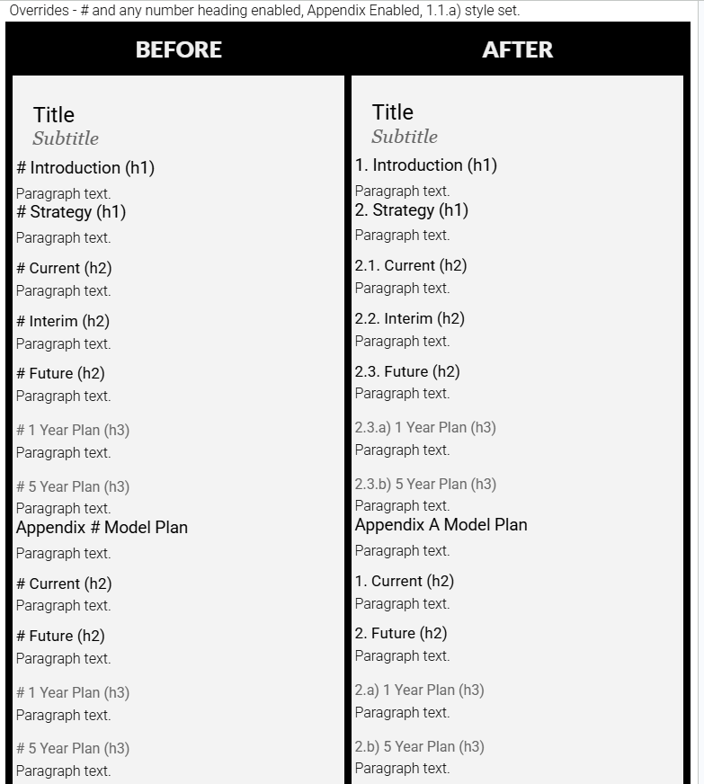
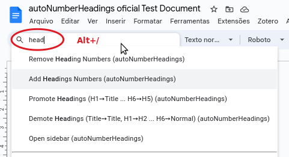
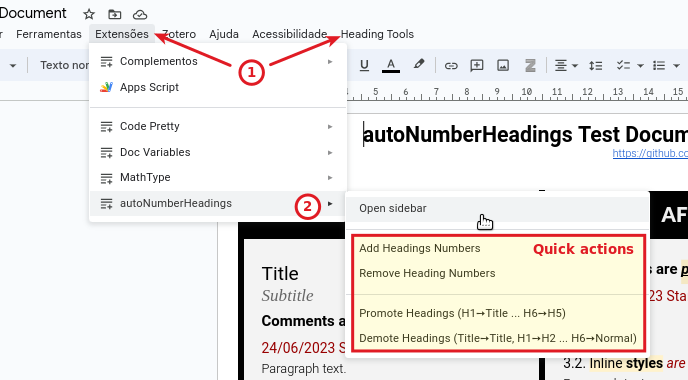
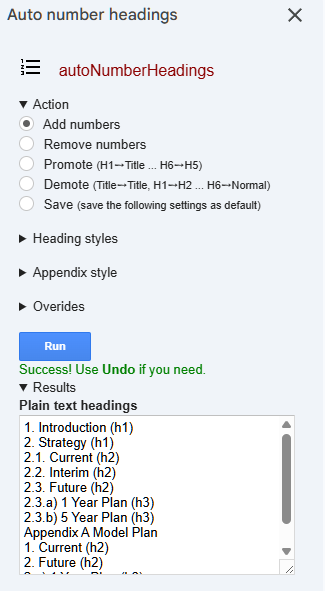
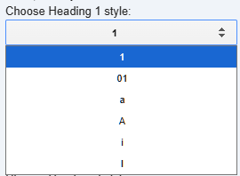
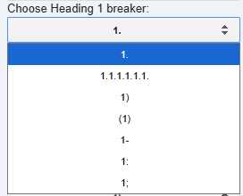
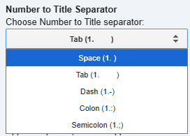
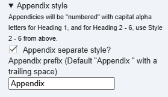
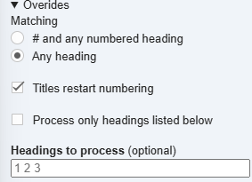

# Auto Number Headings

Use Google Apps Script to Auto Number Headings in a Google Document.

This script¹ lets you easily add or remove numbers to your Google Document Headings and also get them in plain text.

## Features

**Current functionalities are:**

- Menu and Addon UIs.
- Add Headings Numbers
- Remove Heading Numbers
- Promote Headings (H1➙Title ... H6➙H5)
- Demote Headings (Title➙Title, H1➙H2 ... H6➙Normal)
- Outputs processed Headings as plain text
- Option to Add/Remove and Promote/Demote only some heading levels (1-6)
- Option to restart numbering when a Title paragraph occurs
- Option to save settings, which are then used by all subsequent operations
- Automatically apply to selected text, or the current document tab if nothing is selected
- Support Appendix numbering with customisable word (defaults to Appendix)
- Support multiple numbering styles
- Support numbers, alphas and/or roman numerals
- Support dot, dash, colon, semicolon, close and/or () between heading numbers
- Support space, tab, dash, colon and semicolon as the separator between heading numbers and the heading
- Supports ignoring headings so they aren't numbered

Check the [How to install](#how-to-install) if you like it!

## How to use

💡 The easiest way to use it is through the **Lord of The Rings shortcut** `Alt+/` that opens the Help menu with the cursor focused on the find shortcut field.

From there you just need to type `head` to get the basic features:

Or you can use your mouse:

Or you can use the "Open sidebar" function to access the interactive version, which lets you change options and also outputs the plain text headings:

After adding the headings

## Heading Styles

There are a lot of possible combinations of heading styles now available.  

When using the 1.1.1.1.1.1. Heading 1 breaker it sets the style to 1. and breaker to . for all the levels.  
With any other style/breaker, you have to set what you want at each level, as every level is customisable.  

  

The Number to Title Separator allows you to define what character is between your heading number and the heading text.  
If you want to change this, then you **MUST** use the **Remove numbers** option first.  If you do not, your heading will not perform as you expect.  

## Appendix style

The Appendix style works by using the format KeyWord Space UppercaseLetter Separator.  Show below is Appendix as the KeyWord, a Space, A or B as the UppercaseLetter, and a Space as the Separator (it's hard to use a tab in Markdown)  
eg.  
Appendix A This is the 1st appendix  
Appendix B This is the 2nd appendix  

Or you can use a # symbol as you write the document, and allow autoNumberHeadings to do the work for you.  
eg.  
Appendix # This is the 1st appendix  
Appendix # This is the 2nd appendix  

Heading level 1 formatted text will end the Appendix.  
Heading level 2 through 6 will have numbering restarted after an Appendix, but will not have a level 1 number leading them.  
eg.

### Appendix A Example Appendix
1. Heading Level 2 in an Appendix  
1.1. Heading Level 3 in an Appendix  
1.1.a) Heading Level 4 in an Appendix  

## Overides

Overides allow you to change the behaviour of certain aspects of autoNumberHeadings.  

### Matching
Matching controls what is selected for applying numbering to.  
You can use a # as you write the document, and set "# and any numbered heading", and this will allow you to have headings that do not have numbers, just by not putting a number, or a # at the start of the heading.

### Titles
Titles restart numbering allows you to use the Google Style Titles within your document, and the numbering will restart from 1 (or a etc.) on the next heading.  Ensure that you start with a level 1 heading after a title, and don't skip heading levels or you will get zero's turning up.  

### Process only headings listed
This gives you the option of listing specific heading levels to be processed.

## Bugs or missing features?

Feel free to add issues or send pull requests! 😉

If you do send pull requests please make sure to use the [autoNumberHeadings
oficial Test Document](https://docs.google.com/document/d/1gS0ftbeXPRTv2kaY5V-LmCQy1rgAOJEzgsG-9HWmBBE/edit) to create updated images.

## How to install

Note: You'll only need the files `autonumber.gs` and `sidebar.html`. The `code.gs` is here only for historic reasons.

1. Open your document
2. Extensions > Apps Script
3. Give the project a name and save (this name is how it will appear on the Addons submenu)
4. Paste the code from the `autonumber.gs` file over whatever code your file has
5. Click the ➕ sign and create a HTML file named `sidebar`
6. Paste the code from the `sidebar.html` file over the default file content
7. Change back to the `autonumber.gs` file
8. Click on the **Run** button on the menu bar to execute the **onOpen** function and authorize the script for the first time
9. Change to your Document and reload it.

If all went well you'll see a **Heading Tools** menu and also the entry in the **Extensions** menu.

¹ Modified version of [this script](http://pro-web.at/archives/auto-numbering-your-google-docs-headings).
