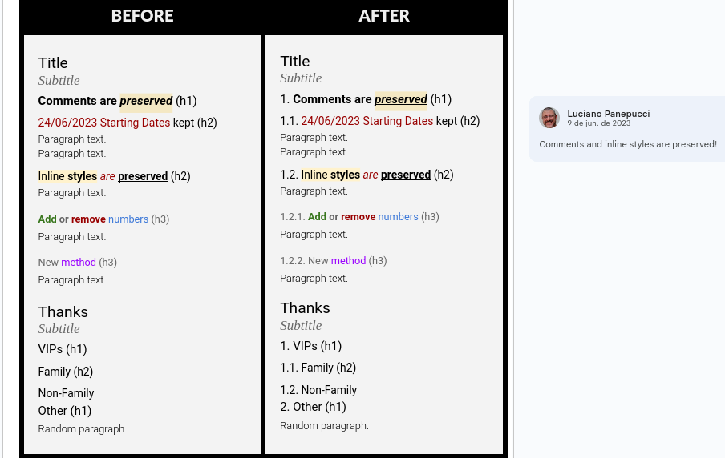
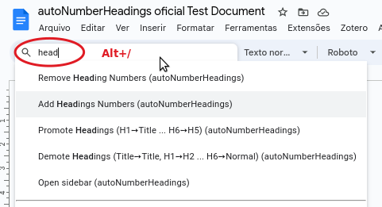
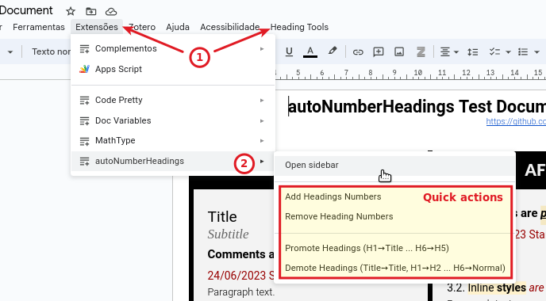

# Auto Number Headings

Use Google Apps Script to Auto Number Headings in a Google Document.

This script¹ lets you easily add or remove numbers to your Google Document Headings and also get them in plain text.

## Features

**Current functionalities are:**

- Menu and Addon UIs.
- Add Headings Numbers
- Remove Heading Numbers
- Promote Headings (H1➙Title ... H6➙H5)
- Demote Headings (Title➙Title, H1➙H2 ... H6➙Normal)
- Outputs processed Headings as plain text
- Option to Add/Remove and Promote/Demote only some heading levels (1-6)
- Option to restart numbering when a Title paragraph occurs
- Option to restrict to selected paragraphs

Check the [How to install](#how-to-install) if you like it!

## How to use

💡 The easiest way to use it is through the **Lord of The Rings shortcut** `Alt+/` that opens the Help menu with the cursor focused on the find shortcut field.

From there you just need to type `head` to get the basic features:

Or you can use your mouse:

Or you can use the "Open sidebar" function to access the interactive version, which lets you change options and also outputs the plain text headings:

## Bugs or missing features?

Feel free to add issues or send pull requests! 😉

If you do send pull requests please make sure to use the [autoNumberHeadings
oficial Test Document](https://docs.google.com/document/d/1gS0ftbeXPRTv2kaY5V-LmCQy1rgAOJEzgsG-9HWmBBE/edit) to create updated images.

## How to install

Note: You'll only need the files `autonumber.gs` and `sidebar.html`. The `code.gs` is here only for historic reasons.

1. Open your document
2. Extensions > Apps Script
3. Give the project a name and save (this name is how it will appear on the Addons submenu)
4. Paste the code from the `autonumber.gs` file over whatever code your file has
5. Click the ➕ sign and create a HTML file named `sidebar`
6. Paste the code from the `sidebar.html` file over the default file content
7. Change back to the `autonumber.gs` file
8. Click on the **Run** button on the menu bar to execute the **onOpen** function and authorize the script for the first time
9. Change to your Document and reload it.

If all went well you'll see a **Heading Tools** menu and also the entry in the **Extensions** menu.

¹ Modified version of [this script](http://pro-web.at/archives/auto-numbering-your-google-docs-headings).
